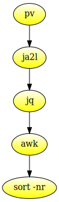
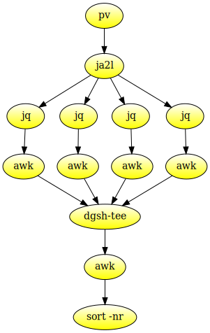

<!DOCTYPE html>
<html lang="en-US">
<head>
<meta charset="utf-8"/>
<title>Processing Wikidata JSON dumps in parallel on the command line with dgsh</title>
<link rel="stylesheet" href="/basic.css"/>
<link rel="stylesheet" href="post.css"/>
<link rel="stylesheet" href="github.css">
<script src="rainbow-custom.min.js"></script>
</head>
<body>

<article resource="https://lucaswerkmeister.de/posts/2017/09/03/wikidata+dgsh/" typeof="BlogPosting">
<header>
<h1 property="headline">Processing Wikidata JSON dumps in parallel on the command line with dgsh</h1>
<address><a rel="author" href="https://lucaswerkmeister.de" typeof="Person"><span property="name" lang="de-DE">Lucas Werkmeister</span></a></address>,
<time property="datePublished" datetime="2017-09-03">2017-09-03</time>.
<link property="publisher" href="https://lucaswerkmeister.de" typeof="Person"/>
<meta property="isAccessibleForFree" content="true"/>
</header>

## Motivation

A few weeks ago, I [wondered][descriptions-tweet] what the most common descriptions on Wikidata were.
I usually use the Wikidata Query Service to answer any questions about Wikidata I have,
but this time that didn’t work,
since there are too many descriptions on Wikidata to check
without running into the query service’s timeout.
At first, I was left at guessing a description
and checking how many times it was used
(counting the occurrences of a single description *is* possible in the query service).
However, after a quick chat on IRC,
[Nikki] produced a script that went through a recent JSON dump of Wikidata
and collected the most common descriptions –
first, for just a handful of languages ([pastebin][descriptions-few-languages]),
then for some more ([pastebin][descriptions-many-languages]).

## First version

I liked the idea of going through the dump to collect these statistics,
and I wanted to see if it was feasible to do this from a shell script,
so I put together a quick pipeline and let it run on my laptop.
I posted the result [in a GitHub Gist][descriptions-all-languages],
and the pipeline I used was:

```shell
time pv latest-all-20170718.json |
    head -n-1 |
    tail -n+2 |
    sed 's/,$//' |
    jq -r '
      .descriptions |
      .[] |
      (.language + "\t" + .value)
    ' |
    awk '
      {
        a[$0]++
      }
      END {
        for (k in a)
          if (a[k] >= 1000)
            print a[k] "\t" k
      }
    ' |
    sort -nr \
    > common-descriptions
```

Here’s the breakdown (feel free to skip any part you feel you already understand ☺):

- `time`: I wanted to know how much wall‑clock time and CPU time the entire timeline consumed.
  (`pv` prints wall‑clock time, but not CPU time.)

- `pv latest-all-20170718.json`: `latest-all-20170718.json` was the dump I had downloaded and extracted.
  `pv` is a tool that is functionally equivalent to `cat`
  (writes the file to standard output),
  but also prints a progress bar with estimated time left to standard error,
  based on how much of the file(s) was already written to standard output.
  (Since the pipe buffer is fairly small,
  the amount of data written by `pv` corresponds fairly well
  to the amount of data consumed by the rest of the pipeline.)

- `head -n-1`: Remove the last line.

- `tail -n+2`: Remove the first line.

- `sed 's/,$//'`: Remove a trailing comma from each line.
  
  Together, the last three steps transform the JSON dump from a single array
  ```json
  [
  {...},
  {...},
  {...}
  ]
  ```
  into a stream
  ```json
  {...}
  {...}
  {...}
  ```
  which is more suitable for ingestion with `jq`.

- `jq`: [jq] is an amazing tool for working with JSON on the command line.
  Here’s what it does in this pipeline:
  
  - `-r`: <b>R</b>aw output.
    Our output is strings, so this means that the string isn’t printed quoted or escaped.
  - `.descriptions`: This selects the `descriptions` member of each value in the input stream.
  - `.[]`: This flattens an array (in this case, of descriptions) into a stream.
  - `(.language + "\t" + .value)`: This prints the language and value of each description,
    separated by a tab.
  
  Together, this prints a stream of all descriptions with language code to standard output.

- `awk`: A classic UNIX tool for processing data line by line. Breakdown:
  
  - `{ a[$0]++ }`: This block runs for each input line.
    `$0` refers to the entire input line,
    and `a[$0]++` takes that as the key into the `a` associative array
    and increments the corresponding value.
    In other words, `a` is an associative array counting how often each input line occurs.
  - `END { ... }`: This block runs after standard input is exhausted, just before the program ends.
  - `for (k in a)`: Runs the following command for each key in the `a` array, where `k` holds the key.
  - `if (a[k] >= 1000)`: `a[k]` is the count of how often the line `k` appeared in the input.
    Runs the following command if that count is greater than or equal to one thousand.
    (This is where we filter for only the most common descriptions.)
  - `print a[k] "\t" k`: Print the count and the input
    (which is a language code and a description),
    separated by a tab.
    The three arguments to `print` are implicitly concatenated without any separator characters.

- `sort -nr`: Sort <b>n</b>umerically in <b>r</b>everse order.
  The input begins with the count for each description,
  so this prints the most common descriptions first.

- `> common-descriptions`: Store the entire result in the `common-descriptions` file.

## Complaints

This pipeline works, but I wasn’t entirely happy with it, for two reasons:

1. We’re using three different commands just to convert the input array to a more convenient form,
   none of which is very efficient for this task,
   and one of which does regex processing!
2. The entire pipeline is CPU‑bound by `jq`,
   and that part is not parallelized,
   so we’re only using one CPU core.

## Enter ja2l

To fix the first problem, I wrote a tiny C program to do the task of the three commands instead:

```c
#include <stdio.h>
#include <stdlib.h>

int main() {
  char *line = NULL;
  size_t len = 0;
  ssize_t read;

  while ((read = getline(&line, &len, stdin)) != -1) {
    line[read-2] = 0;
    printf("%s\n", line);
  }

  free(line);
  exit(EXIT_SUCCESS);
}
```

It’s simple, but it does its job and is much more efficient than the three‑command pipeline.
I eventually cleaned it up a bit
(bugfixes, add command line options, error handling, license, …)
and published it as [ja2l] (<b>J</b>SON <b>a</b>rray <b>to</b> <b>l</b>ines).

## Adding dgsh support

To fix the second problem, I had the idea of using [dgsh] to parallelize the processing.
dgsh stands for “<b>d</b>irected <b>g</b>raph <b>sh</b>ell”
and is an alternative shell
(technically, a fork of [bash])
that extends the notion of pipelines to be directed acyclic graphs instead of just a single string.
Each command can have any number of inputs and outputs,
and when a pipeline is started,
the programs negotiate the input/output file descriptors between them
before starting to execute.
This means that we can *scatter* the JSON lines of the Wikidata dump across several `jq` processes
and then *gather* the results of those processes
before summarizing the description counts and printing the most common descriptions.

That is, we transform the traditional pipeline shown in [figure one](#pipeline-bash)
into the parallelized version shown in [figure two](#pipeline-dgsh).

<figure id="pipeline-bash">

<figcaption>
<i>Figure one:</i>
The traditional shell pipeline.
</figcaption>
</figure>

<figure id="pipeline-dgsh">

<figcaption>
<i>Figure two:</i>
The parallelized pipeline.
<code>dgsh-tee</code> is another name for <code>cat</code>,
which simply concatenates the four output streams into one;
the extra <code>awk</code> is needed to sum up the partial counts of each <code>jq | awk</code> sub‑pipeline.
</figcaption>
</figure>

The version of `tee` included with dgsh
can do this scattering with the `-s` option,
but I wanted to add support for this to `ja2l` as well:
partly because it’s ever so slightly more efficient
(`ja2l` already knows where the line breaks are
because it has to remove trailing commas,
`tee` has to look for them in the input stream),
partly just to play with `dgsh`.
It turns out that the extra code in `ja2l` is fairly small,
and building with dgsh support is as simple
as adding a preprocessor flag and a linker library.

## Result

I am very happy to report that on a system with two physical processor cores (hyperthreaded),
using `ja2l` and `dgsh` reports in a 2.16× speedup (wall‑clock time) over the original script,
with a `pv`‑reported throughput of 69.1 MiB/s instead of 31.2 MiB/s (2.21×).
I tested this with the following polyglot script:

```shell
function countDescriptions {
    jq -r '
      .descriptions |
      .[] |
      (.language + "\t" + .value)
    ' | awk '
      {
        a[$0]++
      }
      END {
        for (k in a)
          print a[k] "\036" k
      }
    '
}

function summarizeDescriptions {
    awk -F$'\036' '
      {
        a[$2] += $1
      }
      END {
          for (k in a)
            if (a[k] >= 1000)
              print a[k] "\t" k
      }
    ' |
    sort -nr
}

file=~/Downloads/latest-all-20170718/latest-100000-20170718.json

if {{ : ; }} ; then dgsh=true; else dgsh=false; fi 2>/dev/null

time if $dgsh; then
    pv -- "$file" |
        ./ja2l |
        {{
            countDescriptions &
            countDescriptions &
            countDescriptions &
            countDescriptions &
        }} |
        cat |
        summarizeDescriptions > common-descriptions-dgsh
else
    pv -- "$file" |
        head -n-1 |
        tail -n+2 |
        sed 's/,$//' |
        countDescriptions |
        summarizeDescriptions > common-descriptions-bash
fi
```

The script tests if it’s running under dgsh or bash,
and chooses the parallel or non-parallel pipeline to run accordingly.
It should be possible to write similar scripts for many other data processing tasks across a Wikidata dump
that can be expressed in `jq`, `awk` and other Unix command line tools,
and speed them up similarly.

[descriptions-tweet]: https://twitter.com/WikidataFacts/status/888785983663112192
[descriptions-few-languages]: https://pastebin.com/raw/0mBBSwDE
[descriptions-many-languages]: https://pastebin.com/raw/DhR3358T
[Nikki]: https://www.wikidata.org/wiki/User:Nikki
[descriptions-all-languages]: https://gist.github.com/lucaswerkmeister/a5b02cda1ce9ea14874dd2828ce57e79
[jq]: https://github.com/stedolan/jq
[ja2l]: https://github.com/lucaswerkmeister/ja2l
[dgsh]: https://www.spinellis.gr/sw/dgsh/
[bash]: https://www.gnu.org/software/bash/

<footer>
<div class="license-info">
<a rel="license" href="http://creativecommons.org/licenses/by-sa/4.0/">

</a><br/>
This work is licensed under a <a rel="license" href="http://creativecommons.org/licenses/by-sa/4.0/">Creative Commons Attribution-ShareAlike 4.0 International License</a>.
</div>
<div class="license-info">
Syntax highlighting is done by a custom build
(included languages: c, generic, json, shell)
of <a href="https://craig.is/making/rainbows">Rainbow</a> 2.1.3,
using its <a href="https://github.com/ccampbell/rainbow/blob/91e5e497406fcbe6def6b72681e61794ebc53a10/themes/css/github.css"><code>github.css</code></a> style.
Rainbow is published under the <a href="https://www.apache.org/licenses/LICENSE-2.0">Apache License, Version 2.0</a>.
</div>
</footer>
</article>
</body>
</html>
